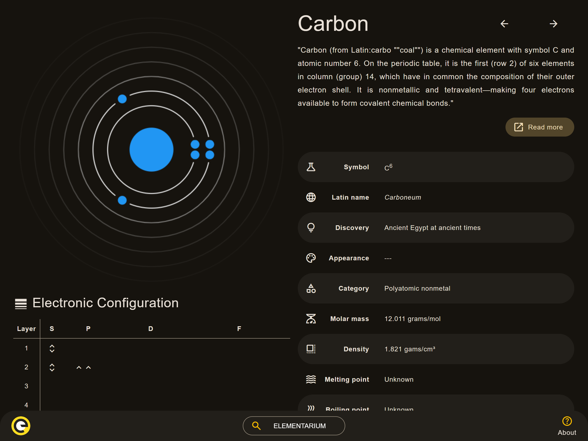
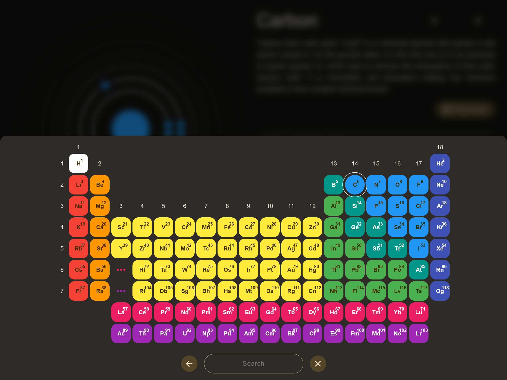

<h1 align="center">
    Elementarium
</h1>

    

## Check it out

Here is the following link to
[see it online](https://github.lucianofelix.com.br/elementarium).

## LICENSE

This project is [MIT Licensed](LICENSE)!